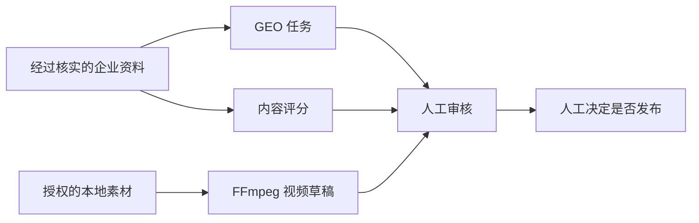

# Content Growth Agent Kit

**Local-first agent toolkit for GEO, enterprise content scoring, and privacy-safe FFmpeg video editing.**

[](https://github.com/coin-workshop3/content-growth-agent-kit/actions/workflows/ci.yml)
[](https://github.com/coin-workshop3/content-growth-agent-kit/releases)
[](https://www.python.org/)
[](LICENSE)
[](#隐私与安全边界)

一个可以直接交给 Codex、Claude Code 等文件型 Agent 使用的企业内容增长工具包。它把 **GEO（Generative Engine Optimization）任务生成、企业内容评分和本地口播视频精剪**做成可读的 `SKILL.md`、JSON 数据契约与可执行 CLI，不需要安装专用桌面平台。

> 核心原则：企业事实可核验，媒体留在本机，所有发布动作必须经过人工确认。

[快速开始](#三步开始) · [Agent 交接](docs/AGENT_HANDOFF.md) · [支持矩阵](docs/SUPPORT_MATRIX.md) · [故障排查](docs/TROUBLESHOOTING.md) · [版本下载](https://github.com/coin-workshop3/content-growth-agent-kit/releases)

## 30 秒看懂

| 能力 | 输入 | 输出 | 适合场景 |
|---|---|---|---|
| `generate-geo-tasks` | 已核实的企业资料 | AI 答案、搜索、对比、风险和证据型任务 | GEO / AI 搜索内容规划 |
| `score-enterprise-content` | 待发布稿件与评分事实 | 7 维评分、事实阻断和修改优先级 | 企业内容质检 |
| `auto-edit-local-video` | 授权使用的本地视频与可选转写 | EDL、SRT、接缝/同步报告和审片草稿 | 口播精剪、素材拼接 |



它是一个 **agent-native toolkit**，不是托管 SaaS，也不是自动发布机器人。仓库不会自动上传素材、登录平台、发布内容、私信客户或替企业做商业承诺。

## 三步开始

### 1. 下载并检查环境

只需要 Python 3.9+：

```bash
git clone https://github.com/coin-workshop3/content-growth-agent-kit.git
cd content-growth-agent-kit
python3 content_growth.py doctor
python3 content_growth.py setup
python3 content_growth.py release-check --core-only
```

也可以在 GitHub 选择 **Download ZIP**，解压后进入目录运行上述 Python 命令，不要求安装 Git。

Windows 可以把 `python3` 替换为 `py -3` 或 PATH 中的 `python`。`doctor` 会说明当前机器能运行哪些能力；`setup` 只给出当前系统的安装引导，不会自动安装软件；`release-check --core-only` 会离线验证下载包、协议、demo 和项目初始化主路径。

### 2. 跑通公开演示

```bash
python3 content_growth.py demo
```

`demo` 使用仓库中的合成示例生成 GEO、评分结果；本机有 FFmpeg 时还会生成两种视频草稿。输出默认位于 `demo-output/`。

### 3. 直接交给 Agent

在 Codex、Claude Code 或其他文件型 Agent 中打开仓库，然后发送：

```text
读取 AGENTS.md、README.md 和 docs/AGENT_HANDOFF.md，
按照 Agent handoff 的首次验收流程完成环境检查、release-check、公开 demo 和项目初始化。
不要自动安装依赖、上传媒体或发布内容，最后汇报每条命令的结果和下一步。
```

需要 Agent 自行下载仓库时，直接复制 [`docs/AGENT_HANDOFF.md`](docs/AGENT_HANDOFF.md) 中包含 GitHub 链接的完整提示词。

## 创建自己的项目

```bash
python3 content_growth.py init projects/my-project
```

然后：

1. 把 `projects/my-project/enterprise-profile.json` 换成经过核实的企业资料。
   完成后把其中的 `template_data` 改为 `false`；模板状态不会生成真实 GEO 任务。
2. 把待评分稿件放进 `projects/my-project/draft.md`。
3. 把授权使用的本地素材放进 `projects/my-project/media/`。
4. 在 Agent 中打开仓库并说：`读取 projects/my-project/AGENT_TASK.md，完成能完成的步骤。`

确定性阶段可以统一运行：

```bash
python3 content_growth.py run projects/my-project
```

默认 `run` 允许部分完成，并在 `run-summary.json` 标记等待 Agent 或素材的阶段。自动化流程可使用 `--strict`：任何请求阶段未完成时返回退出码 2。

## 两个剪辑标准

把授权使用的素材放进项目的 `media/` 后，可以让 Agent 推荐：

```bash
python3 content_growth.py video projects/my-project --mode auto
```

也可以明确选择原有两个标准：

```bash
# 口播精剪
python3 content_growth.py video projects/my-project --mode talking-head

# 本机已经安装 Whisper 时，同时生成自动转写和字幕
python3 content_growth.py video projects/my-project --mode talking-head --auto-transcribe

# 也可以先只生成待人工复核的本地转写
python3 content_growth.py transcribe projects/my-project --model small --language zh

# 标记疑似重复词和口头填充词；只生成候选，不自动删除
python3 content_growth.py review-transcript projects/my-project

# 素材拼接
python3 content_growth.py video projects/my-project --mode material-assembly
```

| 模式 | 基础输入 | FFmpeg-only 能力 | 正式边界 |
|---|---|---|---|
| 口播精剪 | 至少一条有声口播视频 | 检测长停顿、保留呼吸缓冲、生成接缝报告和预览 | 没有人工复核的时间戳转写时只能是 `preview_only` |
| 素材拼接 | `video-script.json` 和多段本地素材 | 按 Hook / Problem / SceneEmotion / Product / Proof / CTA 标签匹配并渲染 | 正式字幕和连续口播仍需要确认文案或真实转写 |

口播项目可增加 `transcript.reviewed.json`。Agent 优先使用 `words[]` 词级时间戳，并按 `keep/delete`、pre/post-roll 和最小停顿生成安全切点；只有 `reviewed: true` 才进入 `ready_for_human_review`。`--auto-transcribe` 调用的是用户本机的 OpenAI Whisper CLI，不上传视频；自动结果保持 `reviewed: false`，仍需人工核对。没有转写时不会假装理解废话或语义，只生成 FFmpeg 静音边界的保守预览。

两个模式都会生成标准 `.srt` 字幕。口播精剪默认使用单行白字、黄色关键词和黑色描边；若本机 FFmpeg 带有 `subtitles/libass` 滤镜就直接烧录，若没有但本机有 Pillow，则使用 PNG overlay fallback；两者都不可用时仍保留不携带视觉样式的 SRT 旁挂字幕。口播精剪还会生成 `join-review.json` 和同步报告，叠化、acrossfade 与 1 秒结尾缓出仍需人工听审。

废话分析只标记 Whisper 实际识别到的“嗯 / 呃”和“然后然后 / 就是就是”等明显候选。模型可能漏掉真实口头词，时间范围也只是按句段估算，因此 `automatic_deletion` 永远是 `false`。

命令退出码 0 和 `render_gate: ready` 只表示草稿成功渲染。两个模式都会保留 `publication_gate: blocked_pending_human_review`；人工审片、事实检查和权利确认完成前，不表示可以发布。

如果目录里有多条有声口播，先查看 `mode-recommendation.json` 中的候选 `asset_id`，再用 `--asset-id <id>` 指定主口播，避免转写和视频错配。

已有经验的 Agent 仍可直接调用底层脚本：

```bash
python3 skills/generate-geo-tasks/scripts/generate_geo_tasks.py \
  --input projects/my-project/enterprise-profile.json \
  --out projects/my-project/output/geo-tasks.json

python3 skills/score-enterprise-content/scripts/calculate_score.py \
  --input projects/my-project/score-evaluation.json \
  --out projects/my-project/output/score-result.json

python3 skills/auto-edit-local-video/scripts/local_video.py check-runtime
```

## 视频依赖：FFmpeg 够不够

基础剪辑只需要用户本机的 `ffmpeg` 与 `ffprobe`，不需要再下载其他 GitHub 视频项目：

- 扫描本地图片和视频
- 读取时长、尺寸和音轨
- 按脚本标签匹配素材
- 生成可检查的 EDL
- 生成标准 SRT 字幕
- 输出基础 9:16 H.264/AAC 视频草稿

高级能力才可能需要额外工具：

| 目标 | 可选工具 |
|---|---|
| 本地自动语音转写 | OpenAI Whisper CLI（`python3 -m pip install -U openai-whisper`） |
| 单行字幕 PNG fallback | Pillow（`python3 -m pip install -U Pillow`）和 FFmpeg `overlay` 滤镜 |
| 更细的逐字时间戳和说话人对齐 | WhisperX |
| 智能删停顿和气口 | auto-editor |
| 复杂字幕 | pysubs2 |
| 动效、强调层和 CTA 包装 | Remotion / HyperFrames |
| 剪映草稿导出 | pyJianYingDraft |

这些工具不属于基础必装项。`doctor` 只检测，不会擅自下载或运行第三方代码。Whisper 首次使用某个模型时可能需要下载模型文件，但源视频仍在本机处理。

如果 `doctor` 显示 FFmpeg 缺失，请从 [FFmpeg 官方下载页](https://ffmpeg.org/download.html) 选择适合当前系统的安装方式；本仓库不捆绑或分发 FFmpeg 二进制。

## 底层框架

- `protocols/base-methodology.json`：开源基础 GEO、评分和视频协议。
- `schemas/`：企业资料、评分、脚本、素材索引、GEO 任务和 EDL 数据契约。
- `skills/`：Agent 工作流和底层执行脚本。
- `content_growth.py`：用户入口，提供 `doctor/setup/release-check/demo/init/run/video/transcribe/review-transcript`。
- `AGENTS.md` / `CLAUDE.md`：Codex 和 Claude Code 的入口说明。

## Agent 最小提示词

```text
读取 AGENTS.md 和目标项目的 AGENT_TASK.md。
只使用经过核实的企业事实和已授权的本地素材，
完成 GEO、评分和可执行的视频阶段，不上传或自动发布。
```

## 适合谁

第一阶段面向已经使用 Codex、Claude Code 或其他文件型 Agent 的个人和小团队。普通企业客户若没有本地 Agent 环境，后续可以在验证需求后再增加可选 UI，而不是把 UI 作为核心产品。

## 隐私与安全边界

- 企业资料、源视频、转写和生成文件默认留在本机，不会被工具包自动上传。
- 自动转写始终标记为未复核；没有人工确认的时间戳不会被描述为句意安全。
- 疑似废话和重复词只生成复核候选，不会自动删除。
- 所有视频草稿都保留 `blocked_pending_human_review` 发布门。
- 公开仓库只包含通用代码、协议、合成示例和文档，不包含客户数据或本地调试素材。

## 稳定性与支持

- [`docs/SUPPORT_MATRIX.md`](docs/SUPPORT_MATRIX.md)：Windows、macOS、Linux 和可选 Whisper 的明确支持范围。
- [`docs/TROUBLESHOOTING.md`](docs/TROUBLESHOOTING.md)：Python、FFmpeg、字幕、Whisper 和 release-check 排障。
- [`docs/RELEASE_ACCEPTANCE.md`](docs/RELEASE_ACCEPTANCE.md)：P0/P1 定义、Release ZIP 验证和正式版晋级标准。
- GitHub Release 会提供经过 CI 从零解压验证的 ZIP 与 SHA-256；优先下载该资产，而不是不带校验和的自动 Source code 链接。

## English summary

Content Growth Agent Kit is a local-first, agent-native toolkit for **Generative Engine Optimization (GEO)**, **B2B content scoring**, and **FFmpeg-based talking-head video editing**. It is designed for Codex, Claude Code, and other file-based AI agents. The deterministic GEO and scoring paths require only Python 3.9+; video drafting uses local FFmpeg, with optional local Whisper transcription. Source media stays on the user's machine, and every publishing decision remains human-controlled.

## 项目状态

当前开发目标为 `v1.0.0-rc.1`。稳定范围包括三平台 Python 核心、GEO、评分、缺少 FFmpeg 时的安全降级，以及装有 FFmpeg 时的基础视频草稿；本地 Whisper 保持可选能力，macOS 之外仍需要更多真实素材验收。Release Candidate 通过仓库自动准入后，还需 3–5 个全新 Agent/电脑完成交接，才能晋级正式 `v1.0.0`。

真实本地 Whisper 联调过程与已知误差见 [`docs/REAL_TRANSCRIPTION_VALIDATION.md`](docs/REAL_TRANSCRIPTION_VALIDATION.md)。

## 开源与商业边界

本仓库中的通用 Skills、CLI、基础规则和示例采用 [Apache License 2.0](LICENSE)。行业规则包、客户数据、效果 benchmark、企业私有配置和定制服务不包含在本开源发行中，可以通过独立商业协议提供。
